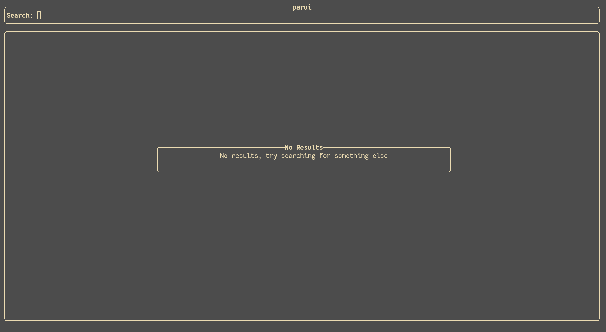
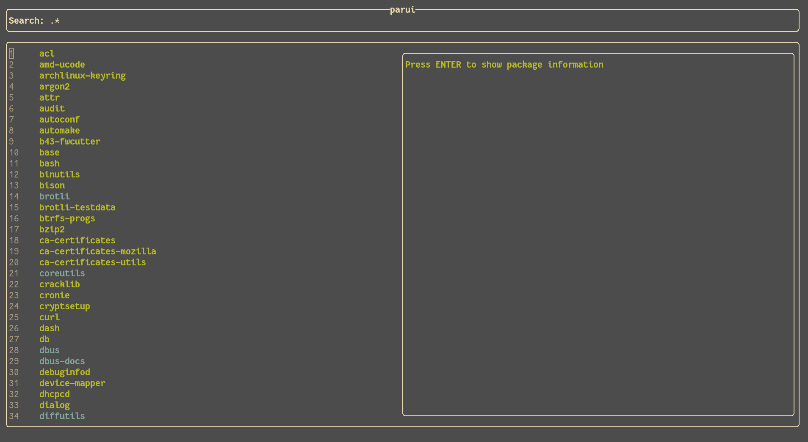
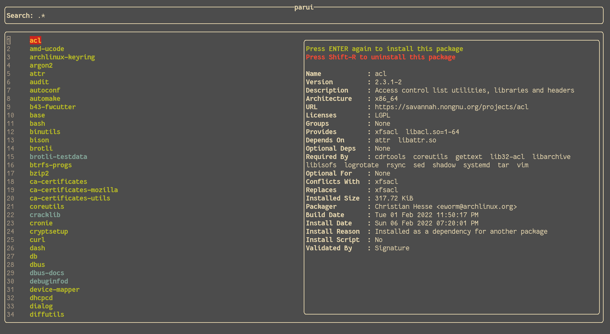
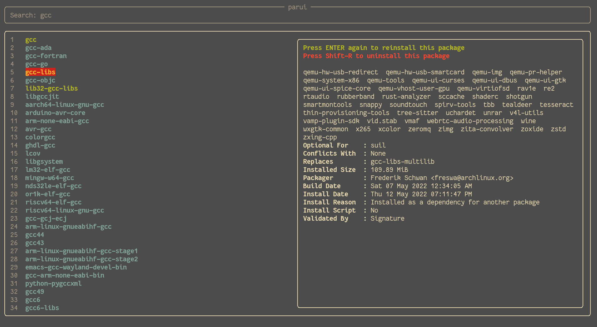

# parui
[](https://crates.io/crates/parui)

### Simple TUI frontend for [paru](https://github.com/morganamilo/paru) or [yay](https://github.com/Jguer/yay).

### Usage

```
Usage: parui [OPTION]... QUERY
        Search for QUERY in the Arch User Repository.,
        Example:
           parui -p=yay rustup

        Options:
           -p=<PROGRAM>
               Selects program used to search AUR
               Not guaranteed to work well
               Default: paru
           -h
               Print this help and exit
```

### Keybinds

parui adopts vim-like keybinds.

| Key                 | Mode   | Action                   |
|---------------------|--------|--------------------------|
| \<Escape\>          | Insert | Enter Select Mode        |
| \<Return\>          | Insert | Search for query         |
| \<C-w\>             | Insert | Removes previous word    |
| \<C-c\>             | Both   | Exits parui              |
| i                   | Select | Enter Insert Mode        |
| \<Return\>          | Select | Find info or installs    |
| \<C-j\>, \<C-Down\> | Select | Moves info one row down  |
| \<C-k\>, \<C-Up\>   | Select | Moves info one row up    |
| h, \<Left\>         | Select | Moves one page back      |
| j, \<Down\>         | Select | Moves one row down       |
| k, \<Up\>           | Select | Moves one row up         |
| l, \<Right\>        | Select | Moves one page forwards  |
| \<S-R\>             | Select | Remove installed package |
| q                   | Select | Exits parui              |

### Images





